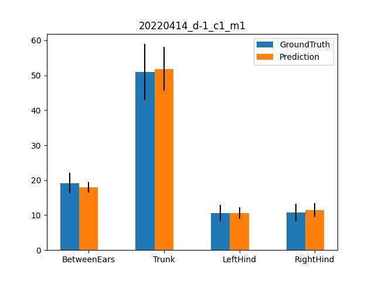
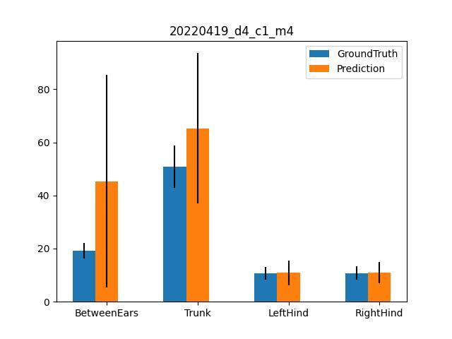

# Trace Prediction Based on DANNCE

## Overall clarification

**Folder structure after set-up**

```
seguralab
    |
    netid_folder (your folder under the lab space, e.g.: nvp17)
        |
        experiment1 (contains all the videos for the series of the experiment)
            |
            20240612_c1_m1 (YYYYMMDD_cX_mX)
            20240612_c1_m1_cylinder (YYYYMMDD_cX_mX_cylinder)
            20240612_c1_m2
            ...
        |
        experiment2
        |
        experiment3

```
Please refer to the above example structure for the following content.
The `base_folder` means the `experiment` folder path.


**IMPORTANT, LEASE READ:**
"Prepare files" means you should download listed file from the GitHub, and drag the file into the `experiment` folder

"input" means copy+paste the code line into the terminal window

All the setting is for 5 min video recordings. If you have a different setting, please reach out to the tdunn lab members.

All the modification of the variable in the script should follow the **exact same format** with the given example. That is, if the path has a "/" at the end, you should have a "/" at the end after modification, if it doesn't then you shuouldn't.

After running the `.sh` file, there will be a `.out` file with the same name that has the output of the bash file. Look for the file under the same path to see the result and debug.

You should be at your `experiment` folder when running all the code below. Todo that, after opening a new terminal, input
`cd /hpc/group/seguralab/your_netid_folder/your_experiment_folder`

## Running Dannce for the first time 
If you have never run dannce before, please follow the following staps to set up your environment.
This part will only need to be done once for each person.

### Miniconda and Dannce installation
1. Prepare files

    - [sophie_install_dannce.sh](https://github.com/Sooophy/dannce/blob/stroke_analysis/trace_protocol/sophie_install_dannce.sh)

2. Start a new terminal, and input:
`bash sophie_install_dannce.sh`

Follow the instruction pops up, enter "yes" or "y" as prompted on the screen.

### Create experiment folder
Manually create a folder for your new sets of experiments under your `netid_folder`

### Follow the steps in the next session for actual data processing


## Running Dannce again after you collect more videos (repeated steps)

If you have run dannce before, please follow the following steps to process you data.

### Camera Prameters Conversion


1. Prepare files

    - [transferParams.m](https://github.com/Sooophy/dannce/blob/stroke_analysis/trace_protocol/transferParams.m)

    - [sophie_transfer_params.sh](https://github.com/Sooophy/dannce/blob/stroke_analysis/trace_protocol/sophie_transfer_params.sh)

2. change the `date_list`  and `base_path` in `sophie_transfer_params.sh` to disired dates in your data.

3. In terminal: `sbatch sophie_transfer_params.sh`

### Folder Organization

1. Prepare files

    - [sophie_check_calibration_folder.py](https://github.com/Sooophy/dannce/blob/stroke_analysis/trace_protocol/sophie_check_calibration_folder.py)

    - [sophie_organize_project_folder.py](https://github.com/Sooophy/dannce/blob/stroke_analysis/trace_protocol/sophie_organize_project_folder.py)

2. change the `base_path` in `sophie_check_calibration_folder.py` to your experiment folder

3. In command window: `python sophie_check_calibration_folder.py` . This should output all the AprilTag folders that contains camera parameters.

4. change the `base_path` in `sophie_organize_project_folder.py` to your experiment folder.

5. In `sophie_transfer_params.sh`, put the dates that outputed date in `AprilTag2` from step3 in `sophie_transfer_params.sh`. If there are only `AprilTag` folders in last step, put `new_params_dates = ["00000000"]`
    
    For example, if you see 
    ```
    20230501_AprilTag2
    20230501_AprilTAg
    ```
    You should put `new_params_dates = ["20230501"]`

    if you see 
    ```
    20230501_AprilTag
    ```
    You should put `new_params_dates = ["00000000"]`

6. In command window, input line by line: 
    ```
    source ~/.bashrc
    conda activate dannce_stroke
    python sophie_organize_project_folder.py
    ```

If there is `AprilTag3` folders printed out in step3, please reach out to us.

### COM Prediction

1. Prepare files

    - [sophie_com_mouse_config.yaml](https://github.com/Sooophy/dannce/blob/stroke_analysis/trace_protocol/sophie_com_mouse_config.yaml)
    - [io.yaml](https://github.com/Sooophy/dannce/blob/stroke_analysis/trace_protocol/io.yaml)
    - [sophie_predict_all_com.sh](https://github.com/Sooophy/dannce/blob/stroke_analysis/trace_protocol/sophie_predict_all_com.sh)

2. Change the `base_path` in `sophie_predict_all_com.sh` to your experiment folder

3. Change the `date_list` in `sophie_predict_all_com.sh` to the dates you want to predict COM on. 

4. In command window, `sbatch sophie_predict_all_com.sh`

5. Check the result in `sophie_predict_all_com.out` produced in the base folder, You should see `30000` on all project folders. If you see any number that is less than `30000`, redo this step4 until all the numbers are `30000`. This is because some GPU is not compatible with dannce.

6. If there is a folder that cannot reach the number no matter what, then please double check the video in that folder. If you cannot fix the video, add "#" to that folder name so it will be skipped in later analysis.


### DANNCE Prediction

1. Prepare files

    - [sophie_dannce_mouse_config.yaml](https://github.com/Sooophy/dannce/blob/stroke_analysis/trace_protocol/sophie_dannce_mouse_config.yaml)
    - [io.yaml](https://github.com/Sooophy/dannce/blob/stroke_analysis/trace_protocol/io.yaml) (Skip if you already have it when predicting COM)
    - [sophie_predict_all_dannce.sh](https://github.com/Sooophy/dannce/blob/stroke_analysis/trace_protocol/sophie_predict_all_dannce.sh)

2. Change the `base_path` in `sophie_predict_all_dannce.sh` to your experiment folder

3. Change the `date_list` to the dates you want to predict com on. 

4. In command window, `sbatch sophie_predict_all_dannce.sh`

5. Check the result in `sophie_predict_all_dannce.out` produced in the base folder, assuming you have all 5-min video. You should see output number `14` on all project folders. If you see any number that is less than `14` , redo this step5 until all the numbers are `14`.


## DANNCE Prediction post-processing (Get True Label and Smooth)

1. Prepare files

    - [sophie_get_true_label_smooth.py](https://github.com/Sooophy/dannce/blob/stroke_analysis/trace_protocol/sophie_get_true_label_smooth.py)
    - [sophie_get_true_label_smooth_all.sh](https://github.com/Sooophy/dannce/blob/stroke_analysis/trace_protocol/sophie_get_true_label_smooth_all.sh)

2. Change the `base_path` in `sophie_get_true_label_smooth_all.sh` to your experiment folder

3. Change the `date_list` in `sophie_get_true_label_smooth_all.sh` to the dates you want to predict com on. 

4. In command window, `sbatch sophie_get_true_label_smooth_all.sh`. This will generate the smoothed true precition mat files named `smoothed_prediction_twd5_nomedfilt.mat`.


# Optional steps for com and dannce validation

## COM Validation

1. Prepare files
    - [sophie_check_all_com_velocity.py](https://github.com/Sooophy/dannce/blob/stroke_analysis/trace_protocol/sophie_check_all_com_velocity.py)

2. Change the `base_path` in `sophie_check_all_com_velocity.py` to your experiment folder

3. Change the `date_ls` in `sophie_check_all_com_velocity.py` the dates you want to predict com on. make sure `save_path = base_path +'/com_check'`

4. In command window, input line by line: 
    ```
    source ~/.bashrc
    conda activate dannce_stroke
    python sophie_check_all_com_velocity.py
    ```
Skip the first 2 lines if youare already in the `dannce_stroke` environment

5. Go into the `base_path/com_check` folder, check the visualization of com trace, make sure they all look reasonable.

Theortically the result shouldn't have small waves on the tails after 5 mm/frames

Good example


Bad example


## DANNCE Validation

1. Prepare files
    - [sophie_check_prediction_segment_length.py](https://github.com/Sooophy/dannce/blob/stroke_analysis/trace_protocol/sophie_check_prediction_segment_length.py)

2. Change the `base_path` in `sophie_check_prediction_segment_length.py` to your experiment folder

3. Change the `date_ls` in `sophie_check_prediction_segment_length.py` the dates you want to predict com on. Make sure `save_path = base_path + '/check_seg_length_twd5/'`.

4. In command window, input line by line: 
```
source ~/.bashrc
conda activate dannce_stroke
python sophie_check_prediction_segment_length.py
```
Skip the first 2 lines if youare already in the `dannce_stroke` environment

5. Go into the `base_path/check_seg_length_twd5` folder, check the visualization of segment length, make sure they all look reasonable.

Good example



Bad example:


