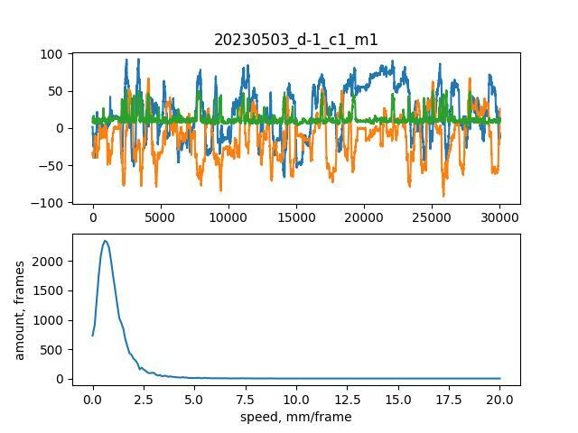
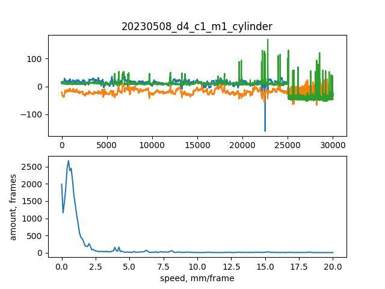
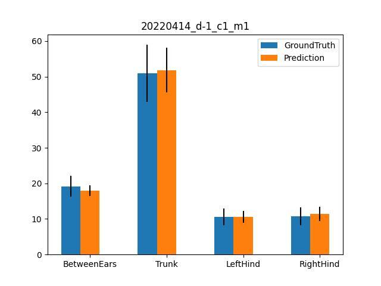

# Trace Prediction Based on DANNCE

## Overall clarification

**Workflow**
1. Collect data, make sure the naming rules matches the standard workflow
2. Update to DCC (Duke Computer Cluster)
3. Prepare the environment
4. Put the code into base folder that directly contains all the project folder
5. Change in all the scripts for: base_folder(`/hpc/group/tdunn/segura-behavior/your_folder`) and the date_list(`[YYYYMMDD, YYYYMMDD]`)
6. Run the code

Prepare files in each steps means you should have the listed file in the base folder that **directly** contains all the project folder. 

All the setting is for 5 min video recordings. If you have a different setting, please reach out to the tdunn lab members.

All the modification of the variable in the script should follow the **exact same format** with the given example. That is, if the path has a "/" at the end, you should have a "/" at the end after modification, if it doesn't then you shuouldn't.

Put all the files in this folder into your base folder.

## Miniconda and Dannce installation

`bash sophie_install_dannce.sh`

## Camera Prameters Conversion

1. Prepare files

    - transferParams.m
    - sophie_transfer_params.sh

2. change the `date_list` in `sophie_transfer_params.sh` to disired dates in your data.

3. In command window: `sbatch sophie_transfer_params.sh`

## Folder Organization

1. Prepare files

    - sophie_check_calibration_folder.py
    - sophie_organize_project_folder.py

2. change the `base_path` in `sophie_check_calibration_folder.py` to your base folder

3. In command window: `python sophie_check_calibration_folder.py` . This should output all the AprilTag folders that contains camera parameters.

4. change the `base_path` in `sophie_organize_project_folder.py` to your base folder.

5. Put the dates that outputed date in `AprilTag2` from step3, and put them in `new_params_dates`. If there are only `AprilTag` folders in last step, put `new_params_dates = ["00000000"]`

6. In command window, input line by line: 
    ```
    source ~/.bashrc
    conda activate dannce_stroke
    python sophie_organize_project_folder.py
    ```

If there is `AprilTag3` folders printed out in step3, please reach out to us.

## COM Prediction

1. Prepare files

    - sophie_com_mouse_config.yaml
    - io.yaml
    - sophie_predict_all_com.sh

2. Change the `base_path` in `sophie_predict_all_com.sh` to your base folder

3. Change the `date_list` in `sophie_predict_all_com.sh` to the dates you want to predict com on. 

4. In command window, `sbatch sophie_predict_all_com.sh`

5. Check the result in `sophie_predict_all_com.out` produced in the base folder, You should see `30000` on all project folders. If you see any number that is less than `30000`, redo this step5 until all the numbers are `30000`. This is because some GPU is not compatible with dannce.

6. If there is a folder that cannot reach the number no matter what, then please double check the video in that folder. If you cannot fix the video, add "#" to that folder name so it will be skipped in later analysis.


## DANNCE Prediction

1. Prepare files

    - sophie_dannce_mouse_config.yaml
    - io.yaml
    - sophie_predict_all_dannce.sh

2. Change the `base_path` in `sophie_predict_all_dannce.sh` to your base folder

3. Change the `date_list` to the dates you want to predict com on. 

4. In command window, `sbatch sophie_predict_all_dannce.sh`

5. Check the result in `sophie_predict_all_dannce.out` produced in the base folder, assuming you have all 5-min video. You should see output number `14` on all project folders. If you see any number that is less than `14` , redo this step5 until all the numbers are `14`.


## DANNCE Prediction post-processing (Get True Label and Smooth)

1. Prepare files

    - sophie_get_true_label_smooth.py
    - sophie_get_true_label_smooth_all.sh

2. Change the `base_path` in `sophie_get_true_label_smooth_all.sh` to your base folder

3. Change the `date_list` in `sophie_get_true_label_smooth_all.sh` to the dates you want to predict com on. 

4. In command window, `sbatch sophie_get_true_label_smooth_all.sh`. This will generate the smoothed true precition mat files named `smoothed_prediction_twd5_nomedfilt.mat`.


# Optional steps for com and dannce validation

## COM Validation

1. Prepare files
    - sophie_check_all_com_velocity.py

2. Change the `base_path` in `sophie_check_all_com_velocity.py` to your base folder

3. Change the `date_ls` in `sophie_check_all_com_velocity.py` the dates you want to predict com on. make sure `save_path = base_path +'/com_check'`

4. In command window, input line by line: 
    ```
    source ~/.bashrc
    conda activate dannce_stroke
    python sophie_check_all_com_velocity.py
    ```
Skip the first 2 lines if youare already in the `dannce_stroke` environment

5. Go into the `base_path/com_check` folder, check the visualization of com trace, make sure they all look reasonable.

Good example



Bad example



## DANNCE Validation

1. Prepare files
    - sophie_check_prediction_segment_length.py

2. Change the `base_path` in `sophie_check_prediction_segment_length.py` to your base folder

3. Change the `date_ls` in `sophie_check_prediction_segment_length.py` the dates you want to predict com on. Make sure `save_path = base_path + '/check_seg_length_twd5/'`.

4. In command window, input line by line: 
```
source ~/.bashrc
conda activate dannce_stroke
python sophie_check_prediction_segment_length.py
```
Skip the first 2 lines if youare already in the `dannce_stroke` environment

5. Go into the `base_path/check_seg_length_twd5` folder, check the visualization of segment length, make sure they all look reasonable.

Good example



Bad example:


